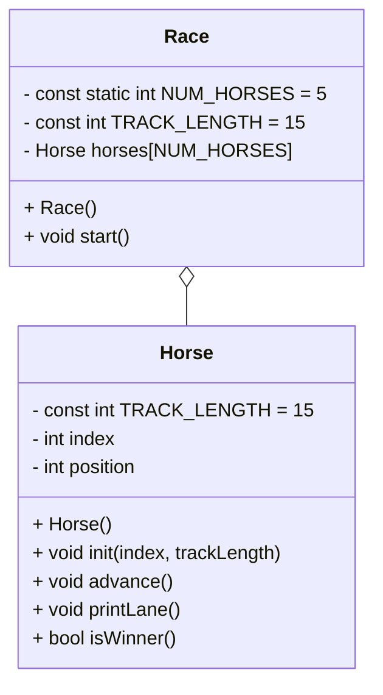

# OOPHorseRaceF25

# UML Diagram

# Algorithm
# Race class
private
int NUM_HORSES
int TRACK_LENGTH
Horse horses[NUM_HORSES]

public
Race()
void start(){
bool keepGoing = true

while keepGoing
    loop for each horse in the array
        call advance from horse class
        call printLane from horse class
        call isWinner from horse class
            if isWinner is true
                set keepGoing to false
}

# Horse class
private
int position
int id
int trackLength

public
Horse()
void init(index, trackLength)

void advance(){
    int coin rand number between 0 and 1;
    add coin to the horses position
}

void printLane(){
    loop through TRACK_LENGTH
        if number of loop is equal to horse's position
            print horse index/name
        else
            print a .
}

void isWinner(){
    create a bool for result set to false
    if horse is at position 15
        set result to true
        print a won statement
    return result
} 

# Main
initialize random number generator (srand)

